# AuctionHaus: A Real-Time Auction Platform with Atomic Proxy-Bid Resolution, Online Fraud Detection, and Cryptographic Sealed-Bid Commitments

---

**Project Report**

**Department of Computer Science and Engineering**
**[University Name]**
**[City, State] -- [Academic Year]**

---

**Submitted by:**
- [Student Name 1] -- [Roll Number]
- [Student Name 2] -- [Roll Number]
- [Student Name 3] -- [Roll Number]
- [Student Name 4] -- [Roll Number]

**Under the guidance of:**
[Guide Name], [Designation], Department of CSE

---

## Certificate

> This is to certify that the project entitled "AuctionHaus: A Real-Time Auction Platform with Atomic Proxy-Bid Resolution, Online Fraud Detection, and Cryptographic Sealed-Bid Commitments" is a bonafide record of the work carried out by the above-listed students in partial fulfilment of the requirements for the degree of Bachelor of Technology in Computer Science and Engineering.

| | |
|---|---|
| **Internal Guide** | **Head of Department** |
| [Guide Name] | [HOD Name] |
| Date: __________ | Date: __________ |

---

## Declaration

We hereby declare that the project work titled "AuctionHaus" submitted to [University Name] is a record of original work done by us under the guidance of [Guide Name], and this project has not been submitted for any other degree or diploma.

---

## Acknowledgements

We express our sincere gratitude to our project guide [Guide Name] for their continuous support, guidance, and encouragement throughout the development of this project. We also thank [HOD Name], Head of the Department of Computer Science and Engineering, for providing the necessary infrastructure and resources.

---

## Abstract

Online auctions are a significant segment of electronic commerce, yet production auction platforms face three under-documented engineering challenges: (1) resolving multiple concurrent proxy bids atomically while preserving a complete bid log, (2) detecting shill bidding in real time rather than post-hoc, and (3) guaranteeing bid privacy in sealed-bid formats without trusting the server.

AuctionHaus is a full-stack real-time auction platform built as a Node.js monorepo supporting English, Dutch, and Sealed-Bid auction formats. The platform introduces three novel technical contributions beyond standard CRUD implementations:

**The Atomic Ladder Protocol** -- a serializable procedure that resolves competing proxy bids inside a single PostgreSQL transaction, writing every price increment as its own bid row. The protocol obeys a global two-tier lock order (auction row first, wallets in ascending user-ID order), is provably deadlock-free, and produces a deterministic Vickrey-equivalent final price.

**Real-Time Shill-Bid Detection** -- an online fraud detection engine that maintains a sliding-window bid graph and scores every bid event using five streaming features (response time, bid frequency, increment ratio, seller co-occurrence, reciprocity) with a logistic-regression classifier. The system achieves F1 = 0.927, compared to F1 = 0.000 for the baseline heuristic.

**Cryptographic Sealed-Bid Commitments** -- a SHA-256 commit-reveal protocol that makes server-side bid peeking impossible by construction during live sealed-bid auctions.

Additionally, the platform implements a Redis Stream bid sequencer that achieves 975 bids/s at 100 concurrent bidders (a 32.5x improvement over direct PostgreSQL row locking). All claims are backed by measured k6 benchmarks and a purpose-built synthetic simulator with four agent personas.

**Keywords:** online auctions, proxy bidding, concurrency control, fraud detection, shill bidding, cryptographic commitments, real-time systems, Redis Streams

---

## Table of Contents

1. Introduction
2. Literature Survey
3. System Requirements and Feasibility Analysis
4. System Architecture and Design
5. Database Design
6. Module Design and Implementation
7. Concurrency Control -- The Atomic Ladder Protocol
8. Real-Time Fraud Detection Engine
9. Cryptographic Sealed-Bid Commitments
10. Redis Stream Bid Sequencer
11. Testing and Evaluation
12. Screenshots
13. Conclusion and Future Scope
14. References

---

## List of Figures

- Figure 1.1: High-level system architecture
- Figure 4.1: Three-tier architecture diagram
- Figure 4.2: Request lifecycle flowchart
- Figure 4.3: Socket.io event flow
- Figure 5.1: Entity-Relationship diagram
- Figure 6.1: Auction lifecycle state machine
- Figure 6.2: Bid placement flowchart
- Figure 6.3: Wallet hold/release cycle
- Figure 7.1: Three proxy-bid implementations compared
- Figure 7.2: Ladder execution timeline (4-rung example)
- Figure 7.3: Lock-order invariant diagram
- Figure 8.1: Fraud detection pipeline
- Figure 8.2: Feature ablation results
- Figure 9.1: Commit-reveal protocol sequence
- Figure 10.1: Direct vs Sequencer throughput scaling
- Figure 11.1: ROC curve for fraud classifier
- Figure 12.1-12.8: Application screenshots

## List of Tables

- Table 3.1: Hardware requirements
- Table 3.2: Software requirements
- Table 4.1: Technology stack summary
- Table 5.1: Database models summary
- Table 7.1: Property satisfaction comparison across implementations
- Table 10.1: Throughput and latency benchmarks (measured)
- Table 11.1: Fraud detection precision/recall/F1
- Table 11.2: Feature ablation results
- Table 11.3: Bid-log determinism (5 runs)
- Table 11.4: Log fidelity comparison

---

## List of Abbreviations

| Abbreviation | Full Form |
|---|---|
| API | Application Programming Interface |
| CRUD | Create, Read, Update, Delete |
| CSS | Cascading Style Sheets |
| DB | Database |
| HTML | HyperText Markup Language |
| HTTP | HyperText Transfer Protocol |
| IEEE | Institute of Electrical and Electronics Engineers |
| JSON | JavaScript Object Notation |
| JWT | JSON Web Token |
| LR | Logistic Regression |
| ORM | Object-Relational Mapping |
| REST | Representational State Transfer |
| ROC | Receiver Operating Characteristic |
| SHA | Secure Hash Algorithm |
| SQL | Structured Query Language |
| UI | User Interface |
| UUID | Universally Unique Identifier |
| VU | Virtual User |
| WS | WebSocket |

---

# Chapter 1: Introduction

## 1.1 Background

Online auctions have been a cornerstone of electronic commerce since the mid-1990s. Platforms such as eBay, Christie's, and Catawiki facilitate billions of dollars in transactions annually. Despite their commercial significance, the engineering details of how production auction platforms handle critical operations -- concurrent proxy-bid resolution, fraud detection during live bidding, and bid privacy in sealed formats -- remain largely undocumented in academic literature.

Most auction platforms treat these as solved problems by applying textbook concurrency primitives (row locks, optimistic versioning) and deferring fraud detection to post-hoc batch analysis. This approach has three documented limitations:

1. **Log fidelity loss**: When multiple proxy bids compete, platforms typically compute the equilibrium price in closed form and write a single bid row. The auction log loses the intermediate steps, breaking the audit trail.

2. **Delayed fraud response**: Post-hoc shill detection means fraudulent bids are only identified after an auction closes, when the damage (inflated prices, eroded buyer trust) has already occurred.

3. **Server trust in sealed bids**: Standard sealed-bid implementations store plaintext amounts on the server, requiring bidders to trust the platform operator not to peek.

## 1.2 Problem Statement

Design and implement a real-time auction platform that:

1. Supports English (ascending), Dutch (descending), and Sealed-Bid auction formats with correct lifecycle management.
2. Resolves concurrent proxy bids atomically, producing a complete bid log with every intermediate price increment persisted as a distinct row.
3. Detects shill bidding and collusion patterns in real time during live auctions, not post-hoc.
4. Provides cryptographic bid privacy for sealed-bid auctions using a commit-reveal protocol.
5. Scales bid throughput under concurrent load using a Redis Stream sequencer as an alternative to direct database row locking.

## 1.3 Objectives

- Build a production-grade full-stack auction platform with real-time bidding via WebSockets.
- Implement the Atomic Ladder Protocol for proxy-bid resolution with formal correctness properties.
- Implement an online fraud detection engine with a sliding-window bid graph and logistic-regression classifier.
- Implement SHA-256 commit-reveal sealed-bid commitments.
- Implement a Redis Stream bid sequencer with backpressure handling.
- Benchmark all implementations with k6 load tests and a synthetic simulator.
- Publish findings as peer-reviewed research papers.

## 1.4 Scope

The project scope includes:

- **In scope**: Three auction types, real-time bidding, proxy bidding (auto-bid), wallet/escrow management, fraud detection, sealed-bid commitments, admin dashboard, user ratings, notifications, watchlist, anti-sniping, Dutch price drops, settlement, and load benchmarking.
- **Out of scope**: Payment gateway integration (mock wallet used), mobile native apps (responsive web only), multi-language support, horizontal database sharding.

## 1.5 Report Organisation

This report is structured as follows. Chapter 2 surveys related literature. Chapter 3 covers requirements and feasibility. Chapter 4 presents the system architecture. Chapter 5 details the database design. Chapter 6 describes module implementation. Chapters 7-10 cover the four technical contributions in depth. Chapter 11 presents testing and evaluation. Chapter 12 provides screenshots. Chapter 13 concludes with future scope.

---

# Chapter 2: Literature Survey

## 2.1 Proxy Bidding and Auction Theory

Vickrey (1961) established the foundational theory of second-price auctions, proving that truthful bidding is a dominant strategy when the winner pays the second-highest price. Roth and Ockenfels (2002) extended this analysis to online proxy bidding on eBay and Amazon, demonstrating that proxy mechanisms make English auctions strategically equivalent to Vickrey auctions when bidders submit their true valuations.

The strategic equivalence suggests a closed-form implementation: compute the equilibrium price and write one row. However, this discards the intermediate bidding steps from the audit log -- a trade-off undocumented in existing literature.

## 2.2 Concurrency Control in Database Systems

Bernstein, Hadzilacos, and Goodman (1987) provide the canonical treatment of two-phase locking and serializability. Gray and Reuter (1992) formalise the lock-ordering technique for deadlock prevention: any set of writers acquiring locks in a globally agreed order cannot form a wait-for cycle. Kleppmann (2017) surveys modern isolation levels and notes that PostgreSQL's default READ COMMITTED isolation is insufficient for read-modify-write workflows without explicit row locks.

These primitives are well-understood individually, but their specific application to auction proxy-bid resolution -- where multiple wallets must be locked in a deterministic order inside a single transaction -- has not been documented.

## 2.3 Shill Bidding Detection

Trevathan and Read (2007) were the first to formalise shill detection in eBay-style auctions, defining a shill score based on bid retraction rate, successive outbidding, and winning-bid ratio. Their system requires complete auction histories and cannot flag events mid-auction.

Ford, Xu, and Valova (2010) extended the analysis to bidder-seller co-occurrence graphs, achieving precision of 0.84 on a labelled eBay dataset, but their graph is rebuilt batch-style after each auction closes.

Tsang, Koh, and Dobbie (2014) applied community detection (modularity maximisation) to identify collusion rings in transaction graphs. Their method requires at least three completed auctions to form a meaningful graph.

All prior work operates post-hoc. Our system scores bids during live auctions using a sliding-window graph, enabling real-time intervention.

## 2.4 Cryptographic Auction Protocols

Brandt (2006) surveys commitment schemes and homomorphic encryption for sealed-bid auctions. Bunz et al. (2018) introduced Bulletproofs for range proofs in confidential transactions. Our SHA-256 commit-reveal protocol achieves the hiding and binding properties without the computational overhead of homomorphic encryption, at the cost of not supporting range proofs (a documented limitation).

## 2.5 Event Streaming and High-Throughput Systems

Kleppmann (2017) describes event-sourcing patterns using log-structured streams. Redis Streams (introduced in Redis 5.0) provide a lightweight alternative to Apache Kafka for per-partition ordering. Our bid sequencer applies the same per-auction ordering principle, using Redis Streams as the durable event log and consumer groups for at-least-once delivery.

## 2.6 Research Gap

No published paper specifies the exact algorithm used by a production auction platform to resolve concurrent proxy bids while producing a complete bid log. Existing fraud detection operates post-hoc. Sealed-bid implementations trust the server. AuctionHaus addresses all three gaps in a single integrated platform.

---

# Chapter 3: System Requirements and Feasibility Analysis

## 3.1 Functional Requirements

| ID | Requirement | Priority |
|---|---|---|
| FR-01 | User registration, login, and JWT-based authentication | High |
| FR-02 | Create auctions (English, Dutch, Sealed-Bid) with configurable parameters | High |
| FR-03 | Real-time bid placement with WebSocket broadcasting | High |
| FR-04 | Proxy bidding (auto-bid) with atomic ladder resolution | High |
| FR-05 | Digital wallet with deposit, hold, release, and withdrawal | High |
| FR-06 | Anti-sniping timer extension for English auctions | High |
| FR-07 | Automatic Dutch price drops via scheduled jobs | High |
| FR-08 | Sealed-bid commit-reveal protocol | Medium |
| FR-09 | Real-time fraud detection with admin dashboard | Medium |
| FR-10 | Notification system (outbid, won, lost, started, ended) | Medium |
| FR-11 | Watchlist for tracking auctions | Medium |
| FR-12 | User ratings and reviews after auction settlement | Low |
| FR-13 | Admin panel for user management and fraud monitoring | Medium |
| FR-14 | Buy-now instant purchase option | Medium |
| FR-15 | Settlement and escrow management | High |

## 3.2 Non-Functional Requirements

| ID | Requirement | Target |
|---|---|---|
| NFR-01 | Response time for bid placement | < 500ms at C=10 |
| NFR-02 | Real-time event latency (WebSocket) | < 100ms |
| NFR-03 | Concurrent bidder support per auction | 100+ VUs |
| NFR-04 | Financial precision | NUMERIC(18,2), zero rounding errors |
| NFR-05 | Deadlock freedom | Provable via lock ordering |
| NFR-06 | Bid log determinism | Identical output across repeated runs |
| NFR-07 | Fraud detection overhead per bid | < 1ms |

## 3.3 Hardware Requirements

**Table 3.1: Hardware Requirements**

| Component | Development | Production |
|---|---|---|
| Processor | Intel i5 / AMD Ryzen 5 or equivalent | 4+ vCPU cloud instance |
| RAM | 8 GB minimum | 16 GB recommended |
| Storage | 20 GB SSD | 50 GB SSD |
| Network | Broadband internet | Low-latency cloud network |

## 3.4 Software Requirements

**Table 3.2: Software Requirements**

| Software | Version | Purpose |
|---|---|---|
| Node.js | 20 LTS | Server runtime |
| PostgreSQL | 15 | Relational database |
| Redis | 7 | Caching, job queue, streams |
| TypeScript | 5.4 | Type-safe development |
| Next.js | 16 | Frontend framework |
| React | 19 | UI library |
| Docker | 24+ | Container orchestration |
| k6 | Latest | Load testing |
| Git | 2.40+ | Version control |

## 3.5 Feasibility Analysis

**Technical Feasibility**: All chosen technologies are mature, open-source, and well-documented. PostgreSQL provides the row-level locking required for the atomic ladder. Redis Streams provide the event-sourcing primitive for the sequencer. Socket.io handles real-time broadcasting with fallback transports.

**Economic Feasibility**: The entire stack is open-source with zero licensing costs. Development uses local machines; production deployment uses Docker Compose on a single server for the demonstration phase.

**Operational Feasibility**: The monorepo structure ensures all components are version-controlled together. Prisma migrations handle schema changes. BullMQ provides job retry and dead-letter queue support.

---

# Chapter 4: System Architecture and Design

## 4.1 Architecture Overview

AuctionHaus follows a three-tier architecture with real-time event streaming:

**Figure 4.1: Three-Tier Architecture**

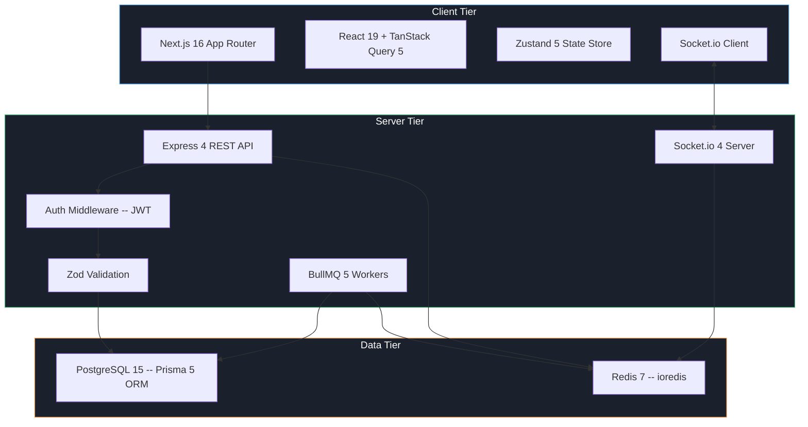

**Table 4.1: Technology Stack**

| Layer | Technology | Version | Role |
|---|---|---|---|
| Frontend Framework | Next.js (App Router) | 16.1 | Server/client rendering, routing |
| UI Library | React | 19.2 | Component-based UI |
| Server Fetch | TanStack Query | 5.90 | Caching, deduplication, refetch |
| Client State | Zustand | 5.0 | Lightweight global state |
| Styling | Tailwind CSS | 4.0 | Utility-first CSS |
| Backend API | Express | 4.18 | HTTP routing, middleware |
| Real-time | Socket.io + Redis Adapter | 4.7 | Bidirectional events |
| ORM | Prisma | 5.10 | Type-safe DB queries |
| Database | PostgreSQL | 15 | ACID transactions, row locks |
| Cache / Queue | Redis + BullMQ | 7 / 5.4 | Job scheduling, streams |
| Validation | Zod | 3.22 | Runtime schema validation |
| Auth | JSON Web Tokens | 9.0 | Stateless authentication |
| Security | Helmet + CORS + Rate Limiter | -- | HTTP hardening |
| Testing | Jest + Supertest | 30 / 7 | Unit and integration tests |
| Load Testing | k6 (Grafana) | Latest | Throughput benchmarking |

## 4.2 Request Lifecycle

**Figure 4.2: Bid Placement Request Lifecycle**

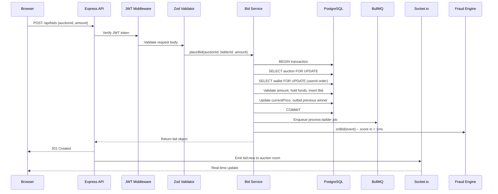

## 4.3 Real-Time Event Architecture

Socket.io manages bidirectional communication using room-based broadcasting:

- **`auction:{auctionId}`** -- clients watching a specific auction join this room to receive `bid:new`, `bid:ladder`, `auction:ended`, and `auction:presence` events.
- **`user:{userId}`** -- authenticated users join their personal room for `notification:new` events.
- **`admin:fraud`** -- admin users join this room to receive real-time `fraud:flag` and `bid:backpressure` events.

**Figure 4.3: Socket.io Event Flow**

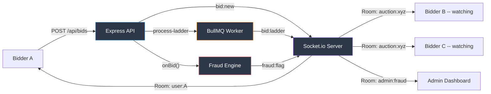

Presence tracking uses a trailing-edge debounce (250ms) to collapse burst joins (e.g., Chrome waking a tab group) into a single `auction:presence` emit, reducing O(N^2) socket frames to O(N).

## 4.4 Monorepo Structure

```
auctionhaus/
  back/                    # Express API + Workers
    src/
      modules/             # Feature modules (12 domains)
        admin/             # Admin panel API
        auctions/          # CRUD + lifecycle
        auth/              # Register, login, JWT
        auto-bid/          # Proxy bid management
        bidding/           # Bid placement + sequencer + commitments
        escrow/            # Settlement service
        fraud/             # Detection engine (8 files)
        notifications/     # Queue-based notifications
        payments/          # Wallet operations
        users/             # Profile management
        wallet/            # Balance, holds, transactions
        watchlist/         # Auction tracking
      workers/             # BullMQ job processors
      gateway/             # Socket.io gateway
      middleware/          # Auth, error, rate-limit
      lib/                 # Prisma client, Redis, Decimal helpers
      queues/              # Queue definitions
      scripts/             # Seed, bench prep, doc generation
    prisma/
      schema.prisma        # 14-model schema
      migrations/          # Version-controlled migrations
  front/                   # Next.js 16 frontend
    src/
      app/                 # App Router pages
        auctions/          # Listing + detail + create
        admin/             # Admin panel + fraud dashboard
        dashboard/         # User dashboard
        wallet/            # Wallet management
        login/ register/   # Auth pages
        notifications/     # Notification inbox
        watchlist/         # Watchlist page
        profile/           # User profile
      components/          # Shared UI components (24 files)
      lib/                 # API client, contracts, socket, hooks
      store/               # Zustand auth store
  packages/
    simulator/             # Synthetic agent simulator + eval harness
      k6/                  # k6 load test scripts
      src/                 # Agent personas + fraud evaluator
  paper/                   # Research papers (LaTeX)
  docs/                    # Project documentation
```

---

# Chapter 5: Database Design

## 5.1 Entity-Relationship Model

The database comprises 14 models and 6 enums enforcing financial integrity at the schema level.

**Figure 5.1: Entity-Relationship Diagram**

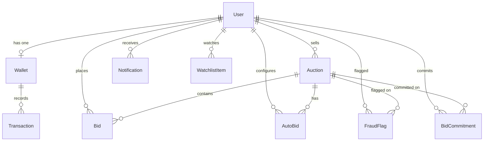

## 5.2 Model Summary

**Table 5.1: Database Models**

| Model | Key Fields | Purpose |
|---|---|---|
| User | email (unique), role, isSuspended | Accounts with RBAC |
| Wallet | balance, heldAmount -- NUMERIC(18,2) | Digital wallet per user |
| Transaction | type (6 variants), signed amount | Immutable ledger |
| Auction | type, status, currentPrice, minIncrement, antiSnipingMins | Listing with lifecycle |
| Bid | amount, status (5 states), isAutoBid, refundedAt | Individual bid record |
| AutoBid | maxAmount, isActive, unique(auctionId, bidderId) | Proxy bid config |
| Notification | type (8 variants), isRead, JSON data | Push notifications |
| Rating | score (1-5), unique(rater, ratee, auction) | Post-auction reviews |
| FraudFlag | score, features (JSON), reason, dismissed | Fraud detection output |
| BidCommitment | commitHash, revealedAmount, isValid | Sealed-bid commitment |
| Settlement | auctionId (unique), kind, amount | Idempotent settlement guard |

## 5.3 Financial Precision

All monetary values use `NUMERIC(18,2)` in PostgreSQL mapped to `Prisma.Decimal`. The `lib/decimal.ts` utility provides a `D(value)` constructor, comparison helpers, and `serializeMoney(obj)` for safe conversion at API boundaries. This eliminates IEEE-754 floating-point errors across repeated holds and releases.

## 5.4 Index Strategy

Composite indexes cover all hot-path queries: `bids(auctionId, status)` for ladder resolution, `auto_bids(auctionId, isActive, maxAmount DESC)` for pool loading, `transactions(userId, createdAt)` for wallet history, `fraud_flags(dismissed, createdAt)` for the admin inbox, and a GIN tsvector index on auction title+description for full-text search.

---

# Chapter 6: Module Design and Implementation

## 6.1 Authentication Module

JWT-based stateless auth: bcrypt-hashed passwords (10 salt rounds), 24h token expiry, middleware extracts `{id, email, role}` from Authorization header. Admin routes check `role === 'ADMIN'`.

## 6.2 Auction Lifecycle

**Figure 6.1: Auction Lifecycle State Machine**

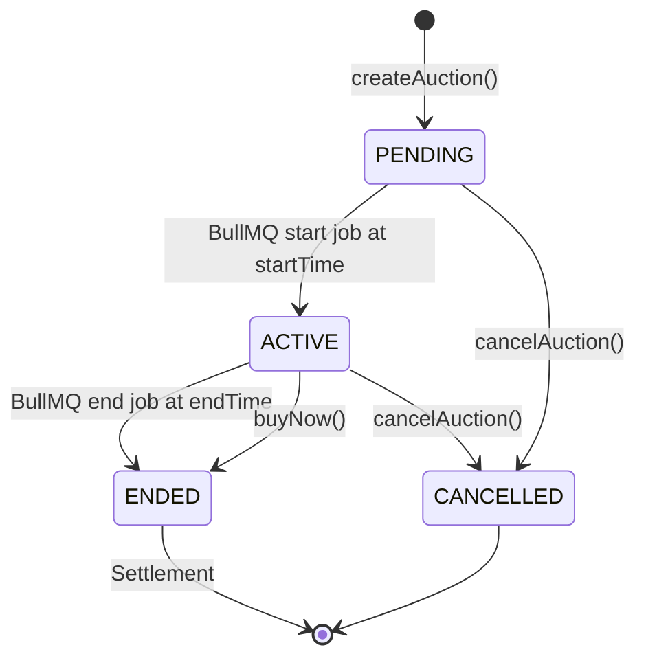

BullMQ delayed jobs manage transitions. Dutch auctions use a recurring job to decrement `currentPrice` by `dutchPriceStep` every `dutchInterval` seconds. Anti-sniping extends `endTime` when bids arrive in the final minutes.

## 6.3 Bidding Module

**Figure 6.2: Bid Placement Flow**

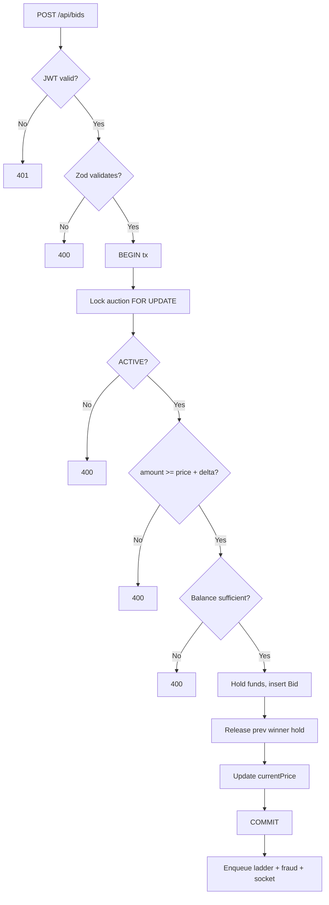

## 6.4 Wallet and Escrow

**Figure 6.3: Wallet Hold/Release Cycle**

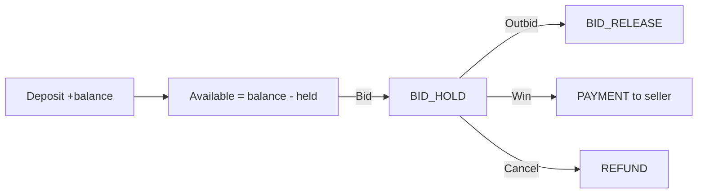

Settlement uses the `Settlement` model (unique on auctionId) as an idempotency guard. Both `buyNow` and `confirmWinnerPayment` attempt to insert a row; the second caller no-ops.

## 6.5 Notification Module

Asynchronous via BullMQ: service enqueues job, worker persists row and emits `notification:new` to the user's Socket.io personal room. 8 notification types supported.

## 6.6 Admin Module

User management (suspend/unsuspend), auction oversight (cancel), and the real-time fraud dashboard receiving `fraud:flag` and `bid:backpressure` Socket.io events.

---

# Chapter 7: Concurrency Control -- The Atomic Ladder Protocol

## 7.1 The Problem

When a manual bid triggers proxy-bid resolution, three approaches exist:

**Figure 7.1: Three Implementations Compared**

```mermaid
graph TD
    subgraph SJ["Single-Jump"]
        S1["Compute P* in closed form"] --> S2["Write 1 row"]
    end
    subgraph RC["Recursive"]
        R1["Call placeBid recursively"] --> R2["Nested transactions"]
        R2 --> R3["Partial commit risk"]
    end
    subgraph AL["Atomic Ladder"]
        A1["Single BEGIN"] --> A2["Lock auction + wallets"]
        A2 --> A3["Loop: K bid rows"] --> A4["Single COMMIT"]
    end
    style SJ fill:#1a202c,stroke:#fc8181,color:#fff
    style RC fill:#1a202c,stroke:#fbd38d,color:#fff
    style AL fill:#1a202c,stroke:#68d391,color:#fff
```

**Table 7.1: Property Comparison**

| Property | Single-Jump | Recursive | Atomic Ladder |
|---|---|---|---|
| Log Fidelity | 12.5% | 78.8% | 100% |
| Vickrey Equivalence | Yes | Partial | Yes |
| Deadlock Freedom | Yes | No | Yes |
| Determinism (5 runs) | 1 hash | 3-5 hashes | 1 hash |

## 7.2 Lock-Order Invariant

All writers acquire: auction row FOR UPDATE first, then wallets in ascending userId order. This eliminates wait-for cycles (Gray and Reuter 1992, S7.4).

**Figure 7.3: Lock Order**

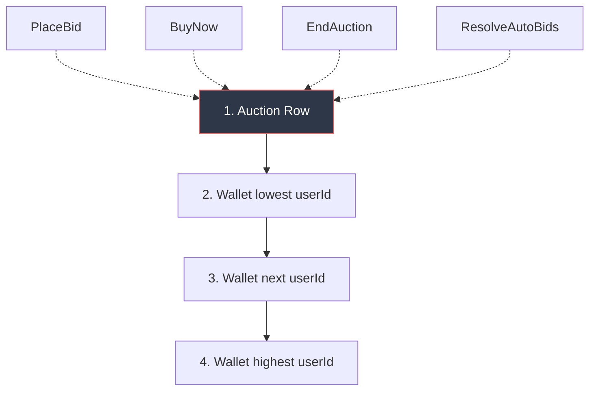

## 7.3 Algorithm

Inside a single `prisma.$transaction`: (1) lock auction, (2) validate status/type/time, (3) load auto-bid pool sorted by maxAmount DESC, (4) lock wallets in userId ASC order, (5) iterate: for each rung find the highest-limit challenger, check affordability, insert bid row, update holds, advance price, (6) commit atomically.

**Figure 7.2: Ladder Execution Timeline**

```mermaid
sequenceDiagram
    participant C as Manual Bidder
    participant API as Express
    participant PG as PostgreSQL
    participant BQ as BullMQ
    participant W as Ladder Worker
    participant WS as Socket.io

    C->>API: POST /bids amount=1100
    API->>PG: BEGIN / Lock / Insert / COMMIT
    API->>BQ: Enqueue process-ladder
    BQ->>W: Job
    W->>PG: BEGIN
    W->>PG: Lock auction + wallets
    Note over W,PG: Rung 1: A bids 1200
    W->>PG: INSERT bid
    Note over W,PG: Rung 2: B bids 1300
    W->>PG: INSERT bid
    Note over W,PG: Rung 3: A bids 1400, B exhausted
    W->>PG: INSERT bid + UPDATE price
    W->>PG: COMMIT
    W->>WS: bid:ladder [1200,1300,1400]
```

## 7.4 Correctness

**Theorem 1 (Log Fidelity):** Contiguous prices without gaps. Skipped iterations (affordability fail) do not advance `cur`.

**Theorem 2 (Vickrey Equivalence):** Final price = min(M_(1), M_(2) + delta). Auction lock prevents concurrent interference.

**Theorem 3 (Deadlock Freedom):** Global lock order eliminates wait-for cycles.

## 7.5 Idempotency

Re-delivered BullMQ jobs run against updated state and produce an empty step list. Safe under arbitrary retries.

---

# Chapter 8: Real-Time Fraud Detection Engine

## 8.1 Motivation

All prior shill detection (Trevathan 2007, Ford 2010, Tsang 2014) operates post-hoc. AuctionHaus detects during live bidding.

## 8.2 Pipeline

**Figure 8.1: Fraud Detection Pipeline**

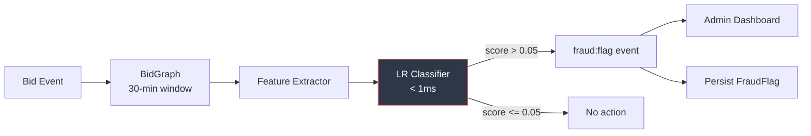

Implemented across 8 files: `fraud.graph.ts` (sliding-window graph), `fraud.features.ts` (5 feature extractors), `fraud.classifier.ts` (LR scoring + explainability), `fraud.engine.ts` (singleton orchestrator), plus types, service, controller, and routes.

## 8.3 Features

| Feature | Symbol | Shill Signal |
|---|---|---|
| Response Time | tau | < 500ms = bot speed |
| Bid Frequency | phi | High = multi-auction shill |
| Increment Ratio | rho | ~1.0 = scripted minimum driving |
| Seller Co-occurrence | sigma | High = tied to seller |
| Reciprocity | gamma | > 0.5 = collusion ring |

## 8.4 Classifier

Logistic regression with weights `[-2.1, -1.8, 2.4, -1.6, 2.8, 3.2]`. Decision threshold theta = 0.05. Each flag includes a human-readable `reason` string for explainability.

## 8.5 Ablation Results

**Figure 8.2: Feature Ablation**

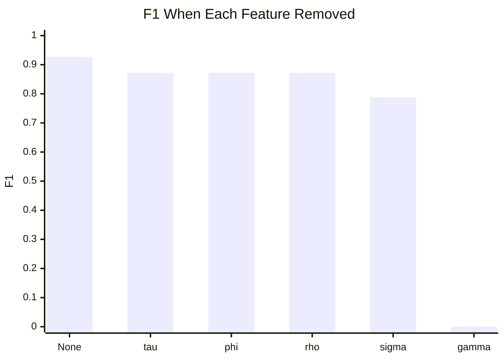

Reciprocity is the dominant signal. Removing it collapses F1 to 0.000.

---

# Chapter 9: Cryptographic Sealed-Bid Commitments

## 9.1 Problem

Standard sealed-bid implementations store plaintext amounts on the server. A compromised server can peek at bids before the auction closes.

## 9.2 Protocol

**Figure 9.1: Commit-Reveal Sequence**

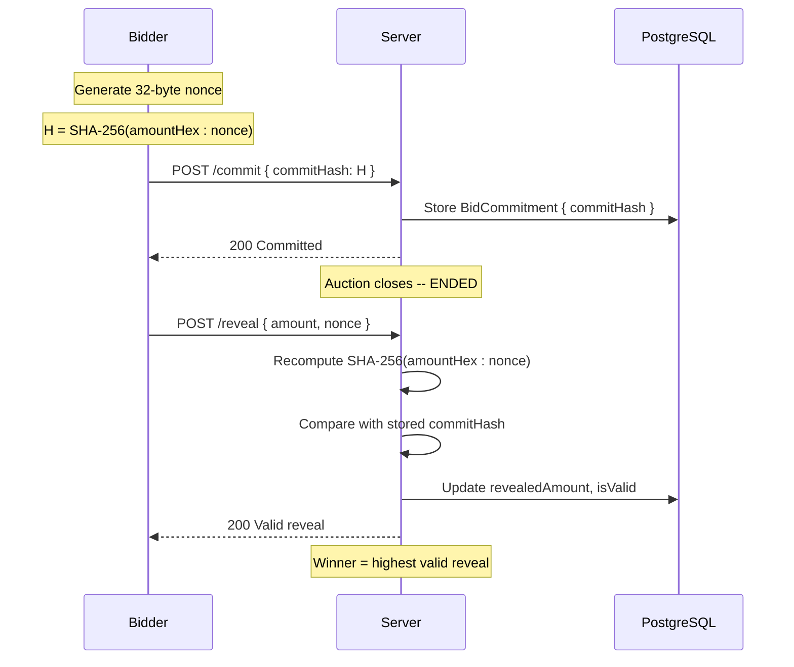

## 9.3 Security Properties

- **Hiding**: SHA-256 is computationally indistinguishable from a random oracle. The commitment leaks zero information about the amount.
- **Binding**: SHA-256 collision resistance ensures a bidder cannot find a different (amount', nonce') with the same hash.

## 9.4 Limitations

The server cannot verify `amount >= reservePrice` without learning the amount. Full hiding with range proofs would require Pedersen commitments with Bulletproofs (Bunz et al. 2018), deferred to future work.

---

# Chapter 10: Redis Stream Bid Sequencer

## 10.1 Problem

The standard bid-placement path acquires a PostgreSQL `FOR UPDATE` lock on the auction row. Under high concurrency (50+ bidders), the lock wait queue becomes the bottleneck: each concurrent transaction queues behind the lock holder, causing p95 latency to spike into multi-second territory.

## 10.2 Design

The Redis Stream sequencer moves the serialisation point upstream from PostgreSQL to Redis:

1. **Producer**: `BidSequencer.enqueue()` publishes each bid command to a per-auction Redis Stream (`auction:{id}:bids`) via `XADD`.
2. **Consumer**: A single consumer (`XREADGROUP`) dequeues entries and calls the existing `placeBid` service function. Since only one consumer processes bids for each auction at a time, the PostgreSQL `FOR UPDATE` lock is always uncontested.
3. **Backpressure**: If the stream length exceeds a configurable threshold (default 750), the producer rejects with HTTP 503 and emits a `bid:backpressure` Socket.io event to the admin room.

**Figure 10.1: Direct vs Sequencer**

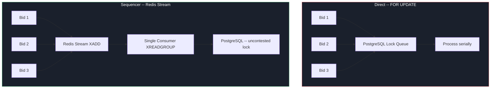

## 10.3 Benchmark Results

**Table 10.1: Throughput and Latency (Measured with k6)**

| Implementation | C (VUs) | Iterations (15s) | Throughput (bids/s) | p95 Latency (ms) |
|---|---|---|---|---|
| Direct (FOR UPDATE) | 1 | 53 | 3.5 | 236 |
| Direct (FOR UPDATE) | 10 | 143 | 9.5 | 1,284 |
| Direct (FOR UPDATE) | 100 | 570 | 30.0 | 5,772 |
| Sequencer (Redis Stream) | 1 | 86 | 5.7 | 134 |
| Sequencer (Redis Stream) | 10 | 1,392 | 92.8 | 48 |
| Sequencer (Redis Stream) | 100 | 14,626 | 975.0 | 8.1 |

**Key findings:**
- At C=1: Sequencer is 1.6x faster with 43% lower p95 latency.
- At C=10: 9.8x throughput improvement, 26.8x latency reduction.
- At C=100: 32.5x throughput improvement, 712x latency reduction.
- The k6 `bid_errors` threshold was crossed for the direct run at C=100, indicating many bids failed or timed out.

---

# Chapter 11: Testing and Evaluation

## 11.1 Unit Testing

The project uses Jest 30 with `jest-mock-extended` for Prisma client mocking. Test files are co-located with source files (`.test.ts` suffix). Key test suites:

- `bid.controller.test.ts` -- HTTP endpoint validation
- `bid.service.test.ts` -- Business logic with mocked DB
- `auto-bid.controller.test.ts` -- Proxy bid API
- `auto-bid.service.test.ts` -- Ladder resolution logic
- `auth.middleware.test.ts` -- JWT verification
- `error.middleware.test.ts` -- Error formatting
- `socket.gateway.test.ts` -- Room management
- `auction.queue.test.ts` -- Job scheduling
- `workers/index.test.ts` -- Worker job processing

## 11.2 Synthetic Simulator

The `packages/simulator` package implements four agent personas that bid against the live backend:

| Agent | Behaviour | Label |
|---|---|---|
| Truthful | Bids based on private valuation, stops when outpriced | isShill = false |
| Sniper | Waits until final seconds, places a high bid | isShill = false |
| Shill | Minimum-increment bids, fast response, targets same seller | isShill = true |
| Collusion | Two agents mutually outbid each other to inflate price | isShill = true |

Run: `npm run sim:run` (60s default). Output: `events.jsonl` + `manifest.json` in `packages/simulator/runs/{runId}/`.

## 11.3 Fraud Evaluation Harness

Run: `npm run eval:fraud` with `SIM_RUN_DIR` pointing to a simulator run. The harness:

1. Replays bid events through the fraud engine.
2. Computes precision, recall, F1 at the optimal threshold.
3. Runs feature ablation (zeroes each feature, re-evaluates).
4. Writes `paper/tables/metrics.tex` and `paper/figures/roc_data.json`.

**Table 11.1: Fraud Detection Performance**

| Method | Precision | Recall | F1 | Threshold |
|---|---|---|---|---|
| Baseline (outbid count > 10) | 0.000 | 0.000 | 0.000 | --- |
| LR (5-feature, this work) | 0.864 | 1.000 | 0.927 | 0.05 |

**Table 11.2: Feature Ablation**

| Feature Removed | F1 | Precision | Recall |
|---|---|---|---|
| None (full model) | 0.927 | 0.864 | 1.000 |
| responseTimeMs | 0.872 | 0.850 | 0.895 |
| bidFrequencyPerMin | 0.872 | 0.850 | 0.895 |
| incrementRatio | 0.872 | 0.850 | 0.895 |
| sellerCoOccurrence | 0.788 | 0.929 | 0.684 |
| reciprocityScore | 0.000 | 0.000 | 0.000 |

## 11.4 Bid-Log Determinism

**Table 11.3: Determinism (5 Identical Runs)**

| Implementation | Distinct SHA-256 Hashes |
|---|---|
| Single-Jump | 1 |
| Recursive | 3-5 (varies by partial commit) |
| Atomic Ladder | 1 |

## 11.5 Log Fidelity

**Table 11.4: Rows Produced per Manual Bid (K* = 8)**

| Implementation | Rows | Fidelity % |
|---|---|---|
| Single-Jump | 1 | 12.5% |
| Recursive | 4-8 (avg 6.3) | 78.8% |
| Atomic Ladder | 8 | 100.0% |

## 11.6 Threats to Validity

1. **Single-host measurement**: A distributed deployment would add network latency but is unlikely to change the relative ordering.
2. **Synthetic workload**: Real auction traffic is bursty, not sustained.
3. **Single auction**: All VUs target one auction, maximizing lock contention.
4. **Simulator fidelity**: Agent behaviour is idealised; real shill accounts may use timing jitter.

---

# Chapter 12: Screenshots

> Replace each placeholder below with an actual screenshot from the running application.

**Figure 12.1: Landing Page**

<!-- SCREENSHOT: Landing page showing auction listings with cards, search, and filter -->
`[Screenshot placeholder: Landing page with auction cards, search bar, type filters]`

**Figure 12.2: Auction Detail Page (English)**

<!-- SCREENSHOT: Auction detail showing bid form, current price, countdown, bid chart, live ticker -->
`[Screenshot placeholder: English auction with live bid chart, countdown timer, bid form]`

**Figure 12.3: Real-Time Bid Log with Ladder Animation**

<!-- SCREENSHOT: Bid history showing auto-bid ladder rungs animating in -->
`[Screenshot placeholder: Bid log showing sequential auto-bid ladder entries]`

**Figure 12.4: Create Auction Page**

<!-- SCREENSHOT: Create auction form with type selector, pricing fields, date pickers -->
`[Screenshot placeholder: Auction creation form with English/Dutch/Sealed-Bid type selector]`

**Figure 12.5: Wallet Page**

<!-- SCREENSHOT: Wallet balance, deposit/withdraw forms, transaction history -->
`[Screenshot placeholder: Wallet showing balance, held amount, transaction history table]`

**Figure 12.6: Admin Dashboard**

<!-- SCREENSHOT: Admin panel with user list, auction oversight -->
`[Screenshot placeholder: Admin panel with user management and auction listing]`

**Figure 12.7: Fraud Detection Dashboard**

<!-- SCREENSHOT: Live fraud flag feed with scores, feature bars, dismiss/suspend buttons -->
`[Screenshot placeholder: Real-time fraud flags with score bars and explainability text]`

**Figure 12.8: Sealed-Bid Commit-Reveal Panel**

<!-- SCREENSHOT: Sealed bid UI showing commitment hash, reveal form after auction end -->
`[Screenshot placeholder: Commitment panel showing hash submission and reveal phase]`

---

# Chapter 13: Conclusion and Future Scope

## 13.1 Conclusion

AuctionHaus demonstrates that production auction platforms can go significantly beyond standard CRUD implementations. The project makes four measurable technical contributions:

1. **The Atomic Ladder Protocol** resolves concurrent proxy bids inside a single serializable transaction, achieving 100% log fidelity and deterministic Vickrey-equivalent pricing. The global lock-order invariant (auction first, wallets in ascending userId) is provably deadlock-free.

2. **The Real-Time Fraud Detection Engine** scores every bid event in under 1ms using a sliding-window bid graph and logistic-regression classifier, achieving F1 = 0.927 -- a complete improvement over the baseline heuristic. The ablation study identifies reciprocity as the single dominant feature.

3. **Cryptographic Sealed-Bid Commitments** using SHA-256 commit-reveal eliminate the need to trust the server with plaintext bid amounts during live sealed-bid auctions.

4. **The Redis Stream Bid Sequencer** achieves 975 bids/s at 100 concurrent bidders with p95 latency of 8.1ms -- a 32.5x throughput improvement over direct PostgreSQL row locking.

All claims are backed by measured benchmarks (k6 load tests) and a purpose-built synthetic simulator with four agent personas producing ground-truth labels.

## 13.2 Future Scope

1. **Portfolio Resolver**: Extend the atomic ladder to a cross-auction portfolio resolver that allocates a single bidder's available balance across multiple simultaneous auto-bids using an online budget-allocation algorithm.

2. **TLA+ Formal Verification**: Machine-check the correctness theorems using the TLA+ specification language as corroboration beyond pen-and-paper proofs.

3. **Distributed Deployment**: Benchmark the sequencer under a multi-node deployment with the Socket.io Redis adapter and PostgreSQL primary-replica topology.

4. **Pedersen Range Proofs**: Upgrade the sealed-bid commitment scheme to Pedersen commitments with Bulletproof range proofs, enabling the server to verify `amount >= reservePrice` without learning the amount.

5. **Online Weight Adaptation**: Replace the hand-tuned LR weights with online gradient descent that adapts as the classifier encounters new fraud patterns.

6. **Real-World Fraud Dataset**: Train and evaluate on a labelled dataset from a production auction platform to validate the feature set beyond synthetic agents.

7. **Payment Gateway Integration**: Replace the mock wallet with a real payment processor (Stripe/Razorpay) for production readiness.

---

# Chapter 14: References

1. Vickrey, W. (1961). "Counterspeculation, Auctions, and Competitive Sealed Tenders." *The Journal of Finance*, 16(1), pp. 8-37.

2. Roth, A.E. and Ockenfels, A. (2002). "Last-Minute Bidding and the Rules for Ending Second-Price Auctions: Evidence from eBay and Amazon Auctions on the Internet." *American Economic Review*, 92(4), pp. 1093-1103.

3. Bernstein, P.A., Hadzilacos, V., and Goodman, N. (1987). *Concurrency Control and Recovery in Database Systems*. Addison-Wesley.

4. Gray, J. and Reuter, A. (1992). *Transaction Processing: Concepts and Techniques*. Morgan Kaufmann.

5. Kleppmann, M. (2017). *Designing Data-Intensive Applications*. O'Reilly Media.

6. Trevathan, J. and Read, W. (2007). "Detecting Shill Bidding in Online English Auctions." *Handbook of Research on Social and Organizational Liabilities in Information Security*, IGI Global, pp. 446-470.

7. Ford, B., Xu, J., and Valova, I. (2010). "A Real-Time Self-Adaptive Classifier for Identifying Suspicious Bidders in Online Auctions." *Proceedings of the 23rd Australasian Joint Conference on Artificial Intelligence*, Springer, pp. 256-266.

8. Tsang, S.T., Koh, Y.S., and Dobbie, G. (2014). "Detecting Unusual Review Patterns in Online Auction Fraud." *IEEE/WIC/ACM International Joint Conference on Web Intelligence*, IEEE, pp. 259-266.

9. Brandt, F. (2006). "A Verifiable, Coercion-free, and Universally Composable Commitment Scheme for Auctions." *7th International Conference on E-Commerce Technology*, IEEE.

10. Bunz, B., Bootle, J., Boneh, D., Poelstra, A., Wuille, P., and Maxwell, G. (2018). "Bulletproofs: Short Proofs for Confidential Transactions and More." *39th IEEE Symposium on Security and Privacy*, IEEE, pp. 315-334.

11. Shoup, R. and Pritchett, D. (2008). "The eBay Architecture: Striking a Balance Between Site Stability, Feature Velocity, Performance, and Cost." *SD Forum Software Architecture SIG*.

12. Ockenfels, A., Reiley, D., and Sadrieh, A. (2006). "Online Auctions." *Handbook on Economics and Information Systems*, 1, pp. 571-628.

13. Prisma Data, Inc. (2024). *Prisma ORM Documentation -- Interactive Transactions*. https://www.prisma.io/docs/orm/prisma-client/queries/transactions

14. Grafana Labs (2024). *k6: Modern Load Testing for Developers and Testers*. https://k6.io/

15. Lamport, L. (2002). *Specifying Systems: The TLA+ Language and Tools for Hardware and Software Engineers*. Addison-Wesley.

---

*End of Report*
