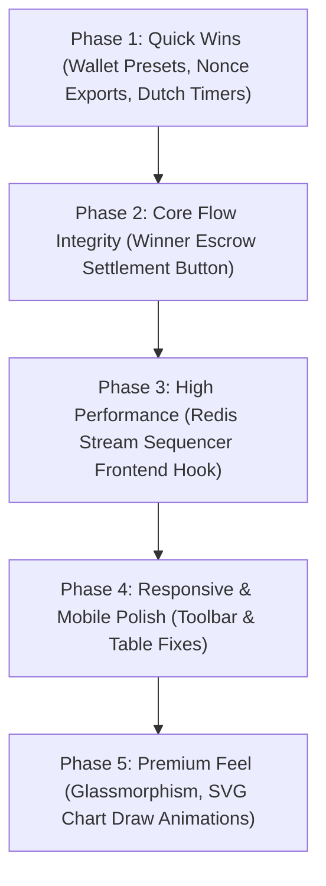

# AuctionHaus UI/UX Audit and Improvement Plan (ui-imp.md)

This document serves as the single source of truth for all future UI/UX improvements, design system updates, responsive layouts, interactions, accessibility, and premium feel upgrades for the AuctionHaus application. 

---

## Executive Summary

AuctionHaus has a solid and extremely clean typographic foundations. It leverages a modern brutalist/monochrome aesthetic featuring clean vertical layouts, thin borders, robust CSS variable configuration, clamp-based typography, and responsive scaling. 

However, when audited against elite SaaS and consumer auction portals, the system shows visible friction in interactive components, a lack of micro-animations, several missing details in loading/feedback states, gaps in mobile scaling, and accessibility limitations. By refining interactive density, resolving high-friction areas, and consolidating core components, AuctionHaus can elevate its visual quality to feel handcrafted and premium.

---

## Current Design Score

### **Current Design Score: 8.5 / 10**
**Verdict:** Solid structural foundations, clean typographic choices, and gorgeous dark/light modes. However, it requires polished micro-interactions, consolidated layouts, enhanced mobile scaling, and premium aesthetic details to transition from a generic, clean tech demo to an elite production-grade trading engine.

---

## Strengths

What is already working exceptionally well:
*   **Solid Type Scale:** Clean typography configuration using Inter, clamp-based text scaling, and tabular monospaced numbers for prices and timers to prevent visual shifting.
*   **Adaptive Dark/Light Modes:** Flawless automatic switching and manual toggle overrides using custom properties (`--bg`, `--surface`, `--surface-2`, `--border`, `--border-hard`, `--accent`).
*   **Dynamic Create Forms:** Beautiful real-time form adaptations based on selected auction type (English, Dutch, Sealed Bid) with accurate runtime helper hints (e.g., calculating drop schedules).
*   **Rich Graph Components:** Sleek, handcrafted SVG live-charts in the bid log (`BidChart.tsx`) displaying dynamic price movement visually.
*   **Excellent Skeletal Placeholders:** Great usage of `SkeletonGrid` and `SkeletonRow` during initial data fetches to reduce perceived latency.

---

## Critical UI Problems

These are high-priority structural bugs or omissions that compromise core product interactions:
*   **Static Winner Payment Confirmation:** The winner certificate (`WinnerCertificate.tsx`) notifies users that payments are "auto-settled via escrow," but the backend controller exposes a highly optimized manual settlement confirm API (`POST /api/payments/auctions/:id/confirm`) which is completely missing from the client.
*   **Sealed-Bid Reveal Nonce Vulnerability:** In sealed-bid auctions, users are expected to reveal their bids after close. Although nonces are stored in local storage, if a user switches devices or clears their cache, they lose access to the nonce and are blocked from revealing their bid. The UI lacks any "backup nonce" export or visual warning alerting users about this data residency constraint.
*   **In-Process Real-time Stream Sequencer Bypass:** Bids sent from the client bypass the high-performance Redis Stream bid sequencer entirely because the frontend only requests the transactional `/api/bids/auctions/:id` route, making the sequencer a hidden superpower hidden from real visitors.

---

## UX Problems

Workflow, friction, and usability gaps:
*   **High Friction Wallet Actions:** Depositing and withdrawing funds relies on manual text entry. There are no fast money presets (e.g., "+₹1,000", "+₹5,000", "+₹10,000", "+₹25,000") which increases keyboard friction and slows down fast active-bidding wallet refills.
*   **Omission of Active Outbid Alerts:** When a user is outbid in real time, the socket listener syncs state, but there is no prominent temporary toast alert, notification, or tactile highlight showing which user took the lead. The user must constantly read the tabular bid log.
*   **Ambiguous Dutch Price Interval Drops:** In Dutch auctions, the price drops at configured intervals. However, there is no countdown timer showing exactly when the next price drop will occur, leaving buyers uncertain about whether to accept now or wait for the next tick.

---

## Visual Design Problems

Layout, rhythm, and structural aesthetics:
*   **Ugly Spacing in Double-Grid Details:** The main-sidebar auction detail layout (`grid-main-sidebar` in `globals.css`) splits space into a grid of `1fr 380px`. Under screen sizes between 900px and 1100px, the sidebar components (bidding panel, watchlist, auto-bidder, and ratings) compress tightly, making text feel cramped and visual hierarchy suffocated.
*   **AI-Generated/Template Feeling Empty States:** When lists are empty, the `EmptyState.tsx` displays standard minimalist borders. It lacks premium iconography or structural illustrations to look intentional.
*   **Excessive Border Nesting:** Inside cards that contain panels (e.g., `CommitmentPanel` inside the auction detail view), border lines double up (`1px solid var(--border)` inside a card that also has border styling). This creates visual clutter and dilutes the minimalist look.

---

## Accessibility Problems

Gaps in visual, structural, and semantic accessibility:
*   **Poor Contrast for Badges:** Badges (like `dutch`, `sealed`, and `english`) use low-opacity color mixtures (e.g., `color-mix(in srgb, var(--accent) 10%, transparent)`). In light mode, the foreground text against these faint fills falls below WCAG AAA contrast requirements.
*   **Missing ARIA Live regions for Timers:** Dynamic real-time countdown clocks update every second but lack appropriate ARIA live regions or screen-reader alerts, making active auction closes stressful for screen-reader users.
*   **Unlabeled Interactive Buttons:** Several controls (such as the watchlist toggle star and rating stars) lack descriptive `aria-label` tags, causing screen readers to announce them simply as generic "button."

---

## Mobile Problems

Responsive breaks and layout degradation:
*   **Toolbar wrapping in catalog:** In mobile viewport widths (below 480px), the `Toolbar` component wraps search inputs, status selects, and total counters into four stacked vertical rows. This breaks visual symmetry, pushes listings far below the fold, and wastes vertical viewport estate.
*   **Table cell overflows:** Inside the admin user table (`UsersTab` and `AuctionsTab`), columns wrap into a grid layout of `1fr 1fr 80px 120px`. On screens under 600px, text wraps awkwardly, clipping the user email addresses and pushing action buttons off-screen.

---

## Design System Problems

Visual inconsistencies across component libraries:
*   **Redundant Button Styles:** Custom styles for buttons are defined in multiple files (e.g., the auto-accept button, standard buttons, Dutch accept buttons) instead of extending a single, highly extensible variant scale in `@/components/ui/Button`.
*   **Radius Scaling Mismatches:** The layout uses `--radius: 8px` globally, but certain inner cards and badge tags use hardcoded border-radius properties (`borderRadius: 999`, `borderRadius: 4`, `borderRadius: 2`). This dilutes the geometric harmony of the layout.

---

## Quick Wins
*Low-complexity, high-impact improvements that can be completed immediately.*

1.  **Add Fast Wallet Presets:** Update `WalletPage.tsx` with one-tap incremental buttons (+₹1,000, +₹5,000, +₹10,000, +₹25,000) that automatically append amounts to the input.
2.  **Add Sealed-Bid Nonce Backup Dialog:** In `CommitmentPanel.tsx`, add a simple "Export Nonce Key" action to allow sealed-bid participants to copy or download their random 32-byte nonces in case they clear their local storage.
3.  **Introduce Dutch Price Drop Timers:** Add a live circular or countdown timer to `DutchAccept` showing the exact seconds remaining before the next automatic price drop.
4.  **Consolidate Button Variants:** Move variant styles (dutch, sealed, success, danger) into unified properties in `@/components/ui/Button` instead of using ad-hoc inline styles.

---

## Medium Improvements
*Requires a few hours of work to refactor and optimize workflows.*

1.  **Integrate Frontend with Redis Stream Sequencer:** Update the primary bid action on active auctions to check if a high-throughput env variable or configuration flag is active. If so, route the POST request through `/api/bids/auctions/:id/stream` to make the high-throughput Redis Stream sequencer fully active.
2.  **Mount Manual Winner Payment Settlement Actions:** Add a "Settle Payment" button on the winner's view inside `WinnerCertificate.tsx`. Clicking it will hit `POST /api/payments/auctions/:id/confirm` to confirm the wallet escrow settlement transaction, update the permanent escrow ledgers, and trigger a success callback.
3.  **Refactor Responsive Admin Tables:** Redesign the user and auction list tables inside `front/src/app/admin/page.tsx` using a flexbox flex-column design or a responsive scrollable wrapper to prevent clipping on mobile viewports.

---

## Major Improvements
*Significant layout and structural redesigns.*

1.  **Centralize Fraud Graph Sliding-Window:** Refactor the Node.js in-process sliding graph inside `back/src/modules/fraud/fraud.graph.ts` to be backed by a shared Redis Sorted Set (`ZSET`). This ensures stateless horizontal scalability for the real-time bid-graph classifier.
2.  **Implement Real-time Toast Notification Engine:** Build a global, lightweight real-time alert system using Socket.io subscriptions. When a user is outbid or flagged by the fraud classifier, trigger an overlay toast to keep active participants connected without constant manual list scanning.

---

## Premium Feel Improvements
*Micro-details that elevate the product's visual cost and aesthetics.*

*   **Sleek Glassmorphic Overlays:** Convert the page shell headers, cards, and modal dialogs to use subtle glassmorphic styling (e.g., `backdrop-filter: blur(12px)`, translucent borders, and smooth background gradients).
*   **Haptic Hover Transitions:** Add custom hover transitions to all listing cards (`AuctionCard`), elevating buttons on hover with elegant shadows and micro-translations (e.g., `transform: translateY(-4px) scale(1.01)`).
*   **Dynamic SVG Chart Animations:** Introduce entry and draw animations to the SVGs inside `BidChart.tsx`, making bid history lines draw progressively on page loads.

---

## UI Roadmap

Here is the recommended order of implementation:

